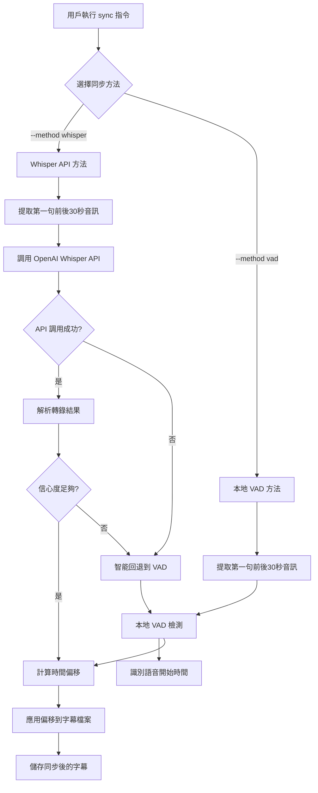

# Backlog 32: 重新設計 Sync 指令架構

## 概覽

本 backlog 涵蓋對 SubX 同步 (sync) 指令的完整重新設計。目前的同步機制基於包絡頻譜分析來檢測對話時間點，但這種方法的精確度不足。我們將實作兩種新的同步方法：

1. **OpenAI Whisper API 方法** - 使用雲端轉錄服務精確檢測語音時間點
2. **本地 VAD (Voice Activity Detection) 方法** - 使用 `voice_activity_detector` crate 進行本地語音檢測

這是一個重大的架構變更，需要完全重新設計配置結構、同步引擎和相關的指令參數。

## 影響範圍

此重新設計影響以下子系統：
- 同步引擎核心邏輯
- 配置管理系統
- CLI 參數介面
- 音訊處理管道
- 文檔和測試

## 子 Backlogs

此工作被分解為以下子 backlogs：

### [Backlog 32.1: 新同步配置結構設計](./32.1-sync-config-restructure.md)
重新設計 `[sync]` 配置節段，移除舊的包絡頻譜分析相關設定，新增 Whisper API 和本地 VAD 的配置選項。

### [Backlog 32.2: OpenAI Whisper API 整合](./32.2-whisper-api-integration.md)
實作 OpenAI Whisper API 的整合，包括音訊片段提取、API 呼叫、轉錄結果解析和時間點檢測。

### [Backlog 32.3: 本地 VAD 實作](./32.3-local-vad-implementation.md)
整合 `voice_activity_detector` crate，實作本地語音活動檢測功能，包括音訊處理、語音檢測和時間點提取。

### [Backlog 32.4: 同步引擎重構](./32.4-sync-engine-refactor.md)
重構現有的同步引擎，移除包絡頻譜分析邏輯，整合新的 Whisper API 和本地 VAD 方法。

### [Backlog 32.5: CLI 參數更新](./32.5-cli-args-update.md)
更新 sync 指令的 CLI 參數，新增方法選擇、配置選項和相關參數。

### [Backlog 32.6: 文檔和測試更新](./32.6-docs-tests-update.md)
更新配置指南、技術文檔，並建立完整的測試套件涵蓋新的同步功能。

## 技術架構概述

### 新的同步工作流程



### 新配置結構預覽

```toml
[sync]
# 基本設定
default_method = "whisper"           # 預設同步方法: whisper, vad
analysis_window_seconds = 30        # 分析時間窗口（第一句前後秒數）
max_offset_seconds = 60.0           # 最大允許偏移量

# Whisper API 設定
[sync.whisper]
enabled = true                       # 啟用 Whisper API 方法
model = "whisper-1"                 # Whisper 模型選擇
language = "auto"                   # 語言設定，auto 為自動檢測
temperature = 0.0                   # API 溫度參數
timeout_seconds = 30                # API 超時時間
fallback_to_vad = true              # Whisper 失敗時是否回退到 VAD
min_confidence_threshold = 0.7      # 最低信心度閾值，低於此值回退到 VAD

# 本地 VAD 設定
[sync.vad]
enabled = true                      # 啟用本地 VAD 方法
sensitivity = 0.75                  # 語音檢測敏感度
chunk_size = 512                   # 音訊塊大小
sample_rate = 16000                # 處理採樣率
padding_chunks = 3                 # 語音檢測前後填充塊數
```

### 核心技術決策

1. **Breaking Change 策略**: 完全移除舊配置，不維持向前兼容性
2. **方法選擇**: 支援兩種模式 - Whisper API（含智能回退）、本地 VAD
3. **智能回退機制**: Whisper 方法在 API 不可用或信心度不足時自動回退到 VAD
4. **音訊處理**: 統一使用 30 秒時間窗口分析第一句語音
5. **錯誤處理**: Whisper 模式內建回退機制，VAD 模式純本地運作
6. **性能考量**: 用戶可選擇純本地 VAD 或智能混合 Whisper+VAD 方法

## 成功標準

1. 移除所有舊的包絡頻譜分析程式碼
2. 成功整合 OpenAI Whisper API 和 voice_activity_detector
3. 新配置結構完全運作並有完整驗證
4. 同步精度顯著提升（目標：±100ms 內的精度）
5. 完整的測試覆蓋率和文檔更新
6. 所有現有測試通過或適當更新

## 風險和緩解措施

### 技術風險
- **API 依赖風險**: Whisper API 可能不穩定或有配額限制
  - *緩解*: 實作本地 VAD 作為回退選項
- **音訊格式兼容性**: 不同音訊格式可能需要額外處理
  - *緩解*: 利用現有的 symphonia 音訊轉碼功能
- **性能影響**: 新方法可能比舊方法更慢
  - *緩解*: 提供快速本地 VAD 選項

### 使用者體驗風險
- **Breaking Changes**: 用戶需要更新配置
  - *緩解*: 提供清晰的遷移指南和錯誤訊息
- **複雜性增加**: 更多配置選項可能困惑用戶
  - *緩解*: 提供智能預設值和自動模式

## 時程估算

- **總工時**: 約 40-50 小時
- **預計完成時間**: 2-3 週
- **各子 backlog 預估工時**:
  - 32.1: 8 小時
  - 32.2: 12 小時  
  - 32.3: 10 小時
  - 32.4: 12 小時
  - 32.5: 4 小時
  - 32.6: 8 小時

## Dependencies

- OpenAI API 存取權限和配額
- `voice_activity_detector` crate (0.2.0+)
- 現有的音訊處理基礎設施
- 配置管理系統

## 後續工作

完成此 backlog 後的潛在改進項目：
- 支援更多語音檢測演算法
- 批次處理多個字幕檔案的同步
- 機器學習模型的離線語音檢測
- 進階音訊預處理和降噪功能

---

**負責人**: GitHub Copilot  
**建立日期**: 2025-06-14  
**狀態**: 待開始  
**優先級**: 高
