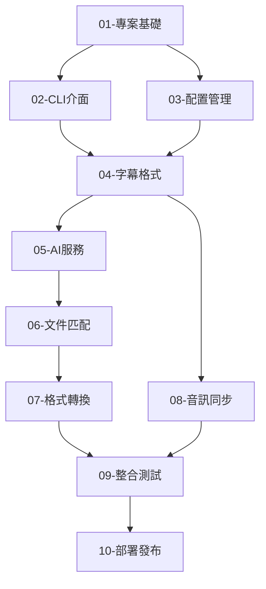

# SubX Product Backlogs

這個目錄包含 SubX 專案的完整開發計劃，分為 10 個階段性的 Product Backlogs。

## 📋 開發階段總覽

| 階段 | 名稱 | 重點領域 | 預估時間 | 複雜度 |
|------|------|----------|----------|--------|
| **01** | [專案基礎建設](01-project-foundation.md) | 架構與工具 | 2-3 天 | 🟢 簡單 |
| **02** | [CLI 介面框架](02-cli-interface.md) | 用戶介面 | 3-4 天 | 🟢 簡單 |
| **03** | [配置管理系統](03-config-management.md) | 系統配置 | 2-3 天 | 🟢 簡單 |
| **04** | [字幕格式引擎](04-subtitle-format-engine.md) | 核心解析 | 5-6 天 | 🟡 中等 |
| **05** | [AI 服務整合](05-ai-service-integration.md) | 智慧功能 | 4-5 天 | 🟡 中等 |
| **06** | [文件匹配引擎](06-file-matching-engine.md) | 核心邏輯 | 4-5 天 | 🟡 中等 |
| **07** | [格式轉換系統](07-format-conversion-system.md) | 資料轉換 | 3-4 天 | 🟡 中等 |
| **08** | [音訊同步引擎](08-audio-sync-engine.md) | 高級演算法 | 5-6 天 | 🔴 困難 |
| **09** | [指令整合測試](09-command-integration.md) | 品質保證 | 4-5 天 | 🟡 中等 |
| **10** | [部署與發布](10-deployment-release.md) | DevOps | 3-4 天 | 🟢 簡單 |

## 🎯 功能領域對應

### 核心功能 (Core Features)
- **Backlog 04**: 字幕格式解析與處理
- **Backlog 06**: AI 驅動的文件匹配
- **Backlog 08**: 音訊-字幕同步

### 用戶體驗 (User Experience)  
- **Backlog 02**: 命令行介面設計
- **Backlog 03**: 配置管理
- **Backlog 07**: 格式轉換工具

### 技術基礎設施 (Infrastructure)
- **Backlog 01**: 專案架構與工具
- **Backlog 05**: AI 服務整合
- **Backlog 09**: 測試與品質保證
- **Backlog 10**: 部署與發布

## 📊 開發進度追蹤

每個 Product Backlog 都包含：

- ✅ **完成項目清單** - 可追蹤的任務分解
- 🎯 **完成標準** - 明確的驗收條件  
- ⚙️ **技術設計** - 詳細的實作指導
- ⏱️ **時間估算** - 合理的開發排程
- ⚠️ **風險評估** - 潛在問題與緩解策略

## 🚀 快速開始

### 開發者入門
1. 閱讀 [專案主文件](../subx_readme.md) 了解專案目標
2. 查看 [架構設計](../subx_architecture.md) 理解技術架構
3. 開始 [Backlog #01](01-project-foundation.md) 建立專案基礎
4. 參考 [總體工作流程](../task.md) 管理開發進度

### 實作指導
- 📖 **[instruct-01-project-foundation.md](instruct-01-project-foundation.md)** - 專案基礎的詳細實作步驟
- 更多實作指導將隨各階段需求逐步提供

## 🔄 依賴關係

## 📈 開發里程碑

### 🎯 MVP (最小可行產品) - 第 23 天
達成基本字幕處理功能：
- ✅ 基礎項目架構 (Backlogs 1-3)
- 🔍 字幕格式支援 (Backlog 4)  
- 🤖 AI 文件匹配 (Backlogs 5-6)
- 🔄 簡單格式轉換 (Backlog 7)

### 🚀 完整功能版本 - 第 35 天  
包含所有核心功能：
- 🎵 音訊同步能力 (Backlog 8)
- 🧪 完整測試覆蓋 (Backlog 9)
- 🛡️ 強健錯誤處理

### 📦 產品發布版本 - 第 40 天
生產就緒的版本：
- 🚀 自動化部署 (Backlog 10)
- 📚 完整文件
- ⚡ 效能最佳化

## 💡 開發最佳實踐

### 程式碼品質
- 每個功能都先撰寫測試 (TDD)
- 使用 `cargo clippy` 進行程式碼檢查
- 維持 80%+ 的測試覆蓋率
- 定期進行程式碼重構

### 協作開發
- 每個 Backlog 對應一個開發分支
- 完成後進行 Code Review
- 更新進度到 [task.md](../task.md)
- 記錄遇到的問題和解決方案

### 風險管理
- **高風險項目** (Backlog 08) 預留額外時間
- **外部依賴** (OpenAI API) 實施備用方案  
- **複雜演算法** 採用迭代式開發

## 🛠️ 技術堆疊概覽

### 核心技術
- **語言**: Rust 2021 Edition
- **CLI 框架**: clap v4
- **非同步**: tokio
- **HTTP**: reqwest
- **序列化**: serde

### 專業函式庫
- **音訊處理**: symphonia, rustfft
- **AI 整合**: OpenAI API
- **用戶介面**: colored, indicatif, dialoguer

### 開發工具
- **測試**: cargo test, assert_cmd
- **品質**: clippy, rustfmt
- **CI/CD**: GitHub Actions

---

## 📞 支援與回饋

開發過程中如遇到問題：
1. 檢查對應 Backlog 的風險評估章節
2. 參考技術設計中的程式碼範例
3. 查看相關 Rust 生態系統文件
4. 更新 [task.md](../task.md) 記錄進度和問題

> 💡 **提示**: 建議按照順序完成各 Backlog，每個階段都有明確的前置條件和交付物。
