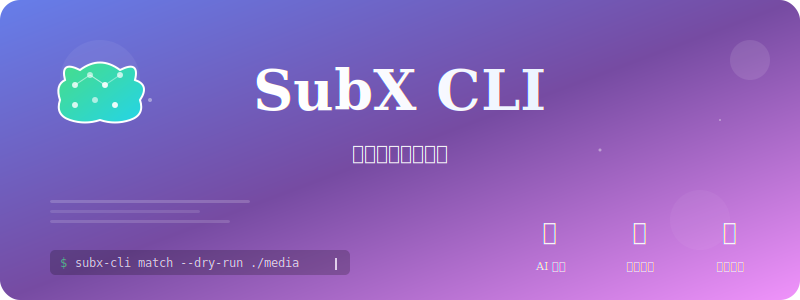

# SubX-CLI

<div align="center">
  

[](https://github.com/jim60105/subx-cli/actions/workflows/build-test-audit-coverage.yml) [](https://github.com/jim60105/subx-cli/actions/workflows/release.yml) [](https://crates.io/crates/subx-cli) [](https://docs.rs/subx-cli) [](https://codecov.io/gh/jim60105/subx-cli)

English | [中文](./README.zh-TW.md)

AI subtitle processing CLI tool, which automatically matches, renames, and converts subtitle files.

</div>

## Features

- 🤖 **AI Smart Matching** - Uses AI technology to automatically identify video-subtitle correspondence and rename files
- 📁 **File Organization** - Automatically copy or move matched subtitle files to video folders for seamless playback
- 🔄 **Format Conversion** - Supports conversion between mainstream subtitle formats like SRT, ASS, VTT, SUB
- ⏰ **Timeline Correction** - Automatically detects and corrects subtitle timing offset issues
- 🏃 **Batch Processing** - Process entire folders of media files at once
- 🔍 **Dry-run Mode** - Preview operation results for safety and reliability
- 📦 **Cache Management** - Reuse previous analysis results for repeated dry-runs to improve efficiency

## Installation

### Linux

#### Method 1: Download and run installation script
```bash
curl -fsSL https://raw.githubusercontent.com/jim60105/subx-cli/master/scripts/install.sh | bash
```

#### Method 2: Direct download of pre-compiled binaries
```bash
# Download latest version
curl -L "https://github.com/jim60105/subx-cli/releases/latest/download/subx-linux-x86_64" -o subx-cli
chmod +x subx-cli
sudo mv subx-cli /usr/local/bin/
```

#### Method 3: Install using Cargo compilation
```bash
# Install from crates.io
cargo install subx-cli

# Or compile from source
git clone https://github.com/jim60105/subx-cli.git
cd subx-cli
cargo build --release
sudo cp target/release/subx-cli /usr/local/bin/
```

## Quick Start

### 1. Configure API Keys
```bash
# Set OpenAI API Key (for AI matching functionality)
export OPENAI_API_KEY="your-api-key-here"

# Optional: Set custom OpenAI Base URL (for OpenAI API or private deployment)
export OPENAI_BASE_URL="https://api.openai.com/v1"

# Or set through configuration commands
subx-cli config set ai.api_key "your-api-key-here"
subx-cli config set ai.base_url "https://api.openai.com/v1"
subx-cli config set ai.model "gpt-4.1-mini"
subx-cli config set general.backup_enabled true
```

### 2. Basic Usage

**Subtitle Matching and Renaming**
```bash
# Process a single folder
subx-cli match /path/to/media/folder

# Preview mode (no actual execution)
subx-cli match --dry-run /path/to/media/folder

# Recursively process subfolders
subx-cli match --recursive /path/to/media/folder

# Copy matched subtitles to video folders
subx-cli match --copy /path/to/media/folder

# Move matched subtitles to video folders
subx-cli match --move /path/to/media/folder

# Combine with recursive and backup options
subx-cli match --recursive --move --backup /path/to/media/folder
```

**Format Conversion**
```bash
# Convert single file
subx-cli convert subtitle.ass --format srt

# Batch conversion
subx-cli convert --format srt /path/to/subtitles/

# Convert while keeping original file
subx-cli convert --keep-original subtitle.vtt --format srt
```

**Timeline Correction**
```bash
# Auto-detect offset
subx-cli sync video.mp4 subtitle.srt

# Manually specify offset
subx-cli sync --offset -2.5 video.mp4 subtitle.srt

# Batch sync entire folder
subx-cli sync --batch /path/to/media/folder
```

**Cache Management**
```bash
# Clear dry-run cache
subx-cli cache clear
```

## Usage Examples

### Typical Workflow
```bash
# 1. Process downloaded videos and subtitles
cd ~/Downloads/TV_Show_S01/

# 2. AI match and rename subtitles with file organization
subx-cli match --dry-run --copy .  # Preview first
subx-cli match --copy .            # Execute after confirmation

# 3. Unify conversion to SRT format
subx-cli convert --format srt .

# 4. Fix time synchronization issues
subx-cli sync --batch .
```

### File Organization Scenarios
```bash
# Scenario 1: Keep original subtitles in place, copy to video folders
subx-cli match --recursive --copy /media/collection/

# Scenario 2: Move subtitles to video folders, clean up original locations
subx-cli match --recursive --move /media/collection/

# Scenario 3: Preview file organization operations
subx-cli match --dry-run --copy --recursive /media/collection/

# Scenario 4: Organize files with backup protection
subx-cli match --move --backup --recursive /media/collection/
```

### Folder Structure Example
```
Before processing (distributed structure):
media/
├── movies/
│   ├── Action/
│   │   └── The.Matrix.1999.1080p.BluRay.mkv
│   └── Drama/
│       └── Forrest.Gump.1994.720p.WEB-DL.mp4
└── subtitles/
    ├── english/
    │   ├── Matrix_EN_Sub.srt
    │   └── ForrestGump_English.srt
    └── chinese/
        ├── 駭客任務_中文字幕.srt
        └── 阿甘正傳.繁中.srt

After processing with --copy option (AI Smart Matching):
media/
├── movies/
│   ├── Action/
│   │   ├── The.Matrix.1999.1080p.BluRay.mkv
│   │   ├── The.Matrix.1999.1080p.BluRay.srt           # AI matched Matrix_EN_Sub.srt and renamed
│   │   └── The.Matrix.1999.1080p.BluRay.zh.srt        # AI matched 駭客任務_中文字幕.srt and renamed
│   └── Drama/
│       ├── Forrest.Gump.1994.720p.WEB-DL.mp4
│       ├── Forrest.Gump.1994.720p.WEB-DL.srt           # AI matched ForrestGump_English.srt and renamed
│       └── Forrest.Gump.1994.720p.WEB-DL.zh.srt        # AI matched 阿甘正傳.繁中.srt and renamed
└── subtitles/                   # Original files preserved
    ├── english/
    │   ├── Matrix_EN_Sub.srt
    │   └── ForrestGump_English.srt
    └── chinese/
        ├── 駭客任務_中文字幕.srt
        └── 阿甘正傳.繁中.srt

After processing with --move option (AI Smart Matching):
media/
├── movies/
│   ├── Action/
│   │   ├── The.Matrix.1999.1080p.BluRay.mkv
│   │   ├── The.Matrix.1999.1080p.BluRay.srt           # AI matched and renamed, then moved
│   │   └── The.Matrix.1999.1080p.BluRay.zh.srt        # AI matched and renamed, then moved
│   └── Drama/
│       ├── Forrest.Gump.1994.720p.WEB-DL.mp4
│       ├── Forrest.Gump.1994.720p.WEB-DL.srt           # AI matched and renamed, then moved
│       └── Forrest.Gump.1994.720p.WEB-DL.zh.srt        # AI matched and renamed, then moved
└── subtitles/                   # Original files removed
    ├── english/                 # Empty directories
    └── chinese/
```

## Configuration

SubX supports comprehensive configuration through environment variables and configuration files.

### Quick Configuration
```bash
# Set OpenAI API Key
export OPENAI_API_KEY="your-api-key-here"

# Optional: Custom OpenAI endpoint
export OPENAI_BASE_URL="https://api.openai.com/v1"

# Or use config commands
subx-cli config set ai.api_key "your-api-key-here"
subx-cli config set ai.model "gpt-4.1-mini"
```

### Configuration File Location
- Linux/macOS: `~/.config/subx/config.toml`
- Windows: `%APPDATA%\subx\config.toml`

For detailed configuration options, see [Configuration Guide](docs/configuration-guide.md).

## Command Reference

### `subx-cli match` - AI Matching and Renaming
```
Options:
  <PATH>                Target folder path
  --dry-run             Preview mode, no actual execution
  --confidence <NUM>    Minimum confidence threshold (0-100, default: 80)
  --recursive           Recursively process subfolders
  --backup              Backup original files before renaming
  --copy, -c            Copy matched subtitle files to video folders
  --move, -m            Move matched subtitle files to video folders

File Organization:
  The --copy and --move options enable automatic file organization for better
  media player compatibility. When subtitles are matched with videos in different
  directories, these options will copy or move the subtitle files to the same
  folder as their corresponding video files.
  
  - --copy: Preserves original subtitle files in their original locations
  - --move: Removes original subtitle files after moving them
  - These options are mutually exclusive and cannot be used together
  - Only applied when subtitle and video files are in different directories
  - Includes automatic filename conflict resolution with backup support

Configuration Support:
  - AI Settings: Support custom API endpoints, models, temperature, etc.
  - Parallel Processing: Support max concurrency, task queue size, priority scheduling, etc.
  - General Settings: Support backup, progress bar, timeout control, etc.
```

### `subx-cli convert` - Format Conversion
```
Options:
  <INPUT>               Input file or folder path
  --format <FORMAT>     Target format (srt|ass|vtt|sub)
  --output, -o <FILE>   Output filename
  --keep-original       Keep original file
  --encoding <ENC>      Specify text encoding (default: utf-8)

Configuration Support:
  - Format Settings: Default output format, style preservation, encoding detection, etc.
```

### `subx-cli detect-encoding` - File Encoding Detection
```
Options:
  <FILES>...             Target file paths
  -v, --verbose          Show detailed sample text

Configuration Support:
  - Format Settings: Encoding detection confidence threshold, default encoding, etc.
```

### `subx-cli sync` - Timeline Correction
```
Options:
  <VIDEO>               Video file path
  <SUBTITLE>            Subtitle file path
  --offset <SECONDS>    Manually specify offset
  --batch               Batch processing mode
  --range <SECONDS>     Offset detection range (default: max_offset_seconds from config)
  --threshold <THRESHOLD>  Correlation threshold (0-1, default: correlation_threshold from config)

Configuration Support:
  - Sync Settings: Maximum offset range, correlation threshold, dialogue detection, etc.
  - Audio Processing: Sample rate, dialogue detection threshold, segment merging, etc.
```

### `subx-cli config` - Configuration Management
```
Usage:
  subx-cli config set <KEY> <VALUE>   Set configuration value
  subx-cli config get <KEY>           Get configuration value
  subx-cli config list                List all configurations
  subx-cli config reset               Reset configuration
```

### `subx-cli cache` - Dry-run Cache Management
```
Options:
  clear                 Clear all dry-run cache files
```

### `subx-cli generate-completion` - Generate Shell Completion Scripts
```
Usage:
  subx-cli generate-completion <SHELL>  Supported shells: bash, zsh, fish, powershell, elvish
```

## Supported Formats

| Format | Read | Write | Description |
|--------|------|-------|-------------|
| SRT    | ✅   | ✅    | SubRip subtitle format |
| ASS    | ✅   | ✅    | Advanced SubStation Alpha format |
| VTT    | ✅   | ✅    | WebVTT format |
| SUB    | ✅   | ⚠️    | Various SUB variant formats |

## Troubleshooting

### Q: What to do if AI matching accuracy is low?

A: Ensure filenames contain sufficient identifying information (like show name, season, episode numbers). You can also try adjusting the `--confidence` parameter or configure AI model temperature: `subx-cli config set ai.temperature 0.1`

### Q: Timeline sync fails?

A: Ensure video files are accessible and check if file formats are supported. If automatic sync isn't ideal, you can try:
- Manually specify offset: `subx-cli sync --offset <seconds> video.mp4 subtitle.srt`
- Adjust sync configuration: `subx-cli config set sync.correlation_threshold 0.6`
- Enable dialogue detection: `subx-cli config set sync.enable_dialogue_detection true`

### Q: Poor performance when processing large numbers of files?

A: You can adjust parallel processing configuration:
```bash
subx-cli config set general.max_concurrent_jobs 8     # Increase concurrency
subx-cli config set parallel.task_queue_size 200     # Increase queue size
subx-cli config set parallel.auto_balance_workers true # Enable load balancing
```

### Q: Inaccurate encoding detection?

A: Adjust detection confidence threshold: `subx-cli config set formats.encoding_detection_confidence 0.8`

### Q: Cache files taking up too much space?

A: Use the `subx-cli cache clear` command to clear all cache files.

### Q: How to re-match when new videos and subtitles are added?

A: Clear cache first with `subx-cli cache clear`, then re-run the match command.

### Q: What to do about task execution timeouts?

A: Increase timeout duration: `subx-cli config set general.task_timeout_seconds 7200`  # Set to 2 hours

### Q: File organization (copy/move) operations fail?
A: Check the following common issues:
- Ensure target video directories have write permissions
- Check if there's sufficient disk space for copy operations
- For filename conflicts, the system will automatically rename files with numeric suffixes
- Use `--dry-run` to preview operations before execution: `subx-cli match --dry-run --copy /path`

### Q: Can I use both --copy and --move together?

A: No, these options are mutually exclusive. Choose either `--copy` to preserve original files or `--move` to clean up original locations.

### Q: Why are some subtitles not being copied/moved to video folders?

A: The copy/move operations only apply when:
- Subtitle and video files are in different directories
- AI matching confidence exceeds the threshold (default 80%)
- Files don't already exist in the target location with identical names
Use `--dry-run` to see which operations will be performed.

### Q: How to handle filename conflicts during copy/move operations?

A: The system automatically handles conflicts by:
- Comparing file content when names match
- Auto-renaming with numeric suffixes (e.g., `movie.srt` → `movie.1.srt`)
- Creating backups when `--backup` is enabled
- Skipping conflicting files and continuing with others

## LICENSE

### GPLv3


[GNU GENERAL PUBLIC LICENSE Version 3](LICENSE)

This program is free software: you can redistribute it and/or modify it under the terms of the GNU General Public License as published by the Free Software Foundation, either version 3 of the License, or (at your option) any later version.

This program is distributed in the hope that it will be useful, but WITHOUT ANY WARRANTY; without even the implied warranty of MERCHANTABILITY or FITNESS FOR A PARTICULAR PURPOSE. See the GNU General Public License for more details.

You should have received a copy of the GNU General Public License along with this program. If not, see [https://www.gnu.org/licenses/](https://www.gnu.org/licenses/).

---

> [!NOTE]  
> This project is fully developed using GitHub Copilot and Codex CLI, with an attempt to maintain the maintainability of the software architecture. My goal is to practice controlling and planning professional software engineering work entirely through prompt engineering with AI. This is what professional vibe coding should be.
