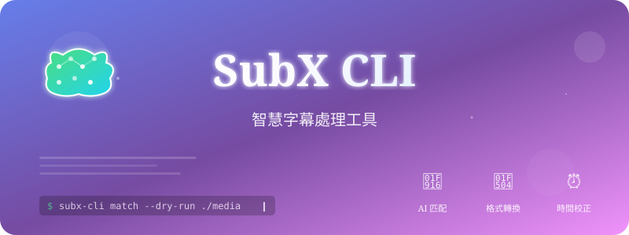

# SubX-CLI

<div align="center">
  

[](https://github.com/jim60105/subx-cli/actions/workflows/build-test-audit-coverage.yml) [](https://github.com/jim60105/subx-cli/actions/workflows/release.yml) [](https://crates.io/crates/subx-cli) [](https://docs.rs/subx-cli) [](https://codecov.io/gh/jim60105/subx-cli)

English | [中文](./README.zh-TW.md)

AI-powered CLI for automated subtitle matching, renaming, format conversion, and timeline correction.

</div>

## What SubX Does

Point SubX at a media folder and it uses AI to figure out which subtitle
files belong to which videos, even when the filenames are in different
languages and share no common naming pattern.

```
Before:
media/
├── movies/
│   └── The.Matrix.1080p.mkv
└── subtitles/
    ├── Matrix_EN_Sub.srt
    └── 駭客任務_中文字幕.srt

After running: subx-cli match --copy media/
media/
├── movies/
│   ├── The.Matrix.1080p.mkv
│   ├── The.Matrix.1080p.srt         ← AI matched Matrix_EN_Sub.srt
│   └── The.Matrix.1080p.zh.srt      ← AI matched 駭客任務_中文字幕.srt
└── subtitles/                         (originals preserved)
    ├── Matrix_EN_Sub.srt
    └── 駭客任務_中文字幕.srt
```

Beyond matching, SubX converts between subtitle formats (SRT, ASS, VTT,
SUB), corrects timing drift using local Voice Activity Detection, detects
file character encodings, and translates subtitle cue text into another
language using the configured AI provider while preserving timing and cue
order.

## Quick Start

```bash
# Install
curl -fsSL https://raw.githubusercontent.com/jim60105/subx-cli/master/scripts/install.sh | bash

# Configure (OpenRouter with free DeepSeek model)
export OPENROUTER_API_KEY="<YOUR_API_KEY>"
subx-cli config set ai.provider openrouter
subx-cli config set ai.model "deepseek/deepseek-r1-0528:free"

# Preview what SubX will do
subx-cli match --dry-run --copy /path/to/media/

# Execute
subx-cli match --copy /path/to/media/
```

For OpenAI, set `OPENAI_API_KEY` instead. For Azure OpenAI, set
`AZURE_OPENAI_API_KEY` and `AZURE_OPENAI_ENDPOINT`. See the
[Configuration Guide](docs/configuration-guide.md) for all provider options
and environment variables.

### Run with a local LLM (Ollama, LM Studio, llama.cpp, vLLM)

Prefer to keep subtitles on-device? Point SubX at any OpenAI-compatible
local runtime — Ollama, LM Studio, llama.cpp's `llama-server`, vLLM, or
any other server that speaks the `POST /chat/completions` protocol — by
selecting the `local` provider. `ollama` is accepted as an alias and is
normalized to `local` at config write time. No API key is required for
typical local setups; SubX contacts only the configured `base_url` and
ignores hosted-provider env vars (`OPENAI_API_KEY`, `OPENROUTER_API_KEY`,
`AZURE_OPENAI_*`) when `local` is selected.

```bash
# Ollama running on the default port
subx-cli config set ai.provider local
subx-cli config set ai.base_url "http://localhost:11434/v1"
subx-cli config set ai.model "llama3.1:8b-instruct"
```

The endpoint can be loopback, a LAN host (`http://192.168.x.x:port/v1`), a
tailnet (`https://host.tailnet.ts.net/v1`), or any reachable
OpenAI-compatible URL. Both `http://` and `https://` schemes are valid for
`local`. See the
[Local / Offline LLM Provider](docs/configuration-guide.md#local--offline-llm-provider)
section for per-runtime examples and known compatibility limits.

## Commands

The `match`, `convert`, `sync`, `detect-encoding`, and `translate` commands
support `-i` for multiple inputs and `--recursive` for subdirectory
scanning. See the [Command Reference](docs/command-reference.md) for full
options, examples, and workflows.

| Command | Purpose | Example |
|---------|---------|---------|
| `match` | AI-match subtitles to videos, rename/copy/move | `subx-cli match --copy ./media` |
| `convert` | Convert between subtitle formats | `subx-cli convert --format srt ./subs/` |
| `sync` | Correct timing via VAD or manual offset | `subx-cli sync video.mp4 subtitle.srt` |
| `detect-encoding` | Identify subtitle file encodings | `subx-cli detect-encoding *.srt` |
| `translate` | AI-translate subtitle text into another language | `subx-cli translate movie.srt --target-language zh-TW` |
| `config` | View and modify settings | `subx-cli config set ai.provider openai` |
| `cache` | Manage dry-run result cache | `subx-cli cache clear` |

## Installation

### Linux / macOS

```bash
# One-line installer (auto-detects host OS, architecture, and libc)
curl -fsSL https://raw.githubusercontent.com/jim60105/subx-cli/master/scripts/install.sh | bash

# Or download the binary directly (pick the asset matching your host)
curl -L "https://github.com/jim60105/subx-cli/releases/latest/download/subx-linux-x86_64" -o subx-cli
chmod +x subx-cli && sudo mv subx-cli /usr/local/bin/
```

### Supported Release Targets

The installer auto-detects the host operating system and CPU architecture
and downloads the matching pre-built binary from the latest GitHub Release.

| Platform | Architecture | Asset name                  | Notes |
|----------|--------------|-----------------------------|-------|
| Linux    | x86_64       | `subx-linux-x86_64`         | x86_64 Linux |
| Linux    | aarch64      | `subx-linux-aarch64`        | ARM64 Linux (Raspberry Pi 4/5, AWS Graviton, Oracle Ampere, ARM64 containers) |
| macOS    | x86_64       | `subx-macos-x86_64`         | Intel Macs |
| macOS    | aarch64      | `subx-macos-aarch64`        | Apple Silicon (M1/M2/M3/M4) |
| Windows  | x86_64       | `subx-windows-x86_64.exe`   | 64-bit Windows |

### From Source (any platform)

```bash
# From crates.io
cargo install subx-cli

# Or compile from the repository
git clone https://github.com/jim60105/subx-cli.git
cd subx-cli
cargo build --release
```

## Supported Formats

| Format | Read | Write | Notes |
|--------|------|-------|-------|
| SRT | ✅ | ✅ | SubRip — most widely supported |
| ASS | ✅ | ✅ | Advanced SubStation Alpha — rich styling |
| VTT | ✅ | ✅ | WebVTT — web-native format |
| SUB | ✅ | ⚠️ | Multiple SUB variants, partial write support |

## Scripting & Automation

Pass `--output json` (before the subcommand) or set `SUBX_OUTPUT=json`
to switch every covered subcommand to a stable, versioned JSON
envelope on stdout — ideal for shell scripts, CI pipelines, and
third-party tooling. Progress bars and status symbols are suppressed
in JSON mode; the existing exit codes are preserved across both modes.

```bash
# Extract the first match candidate's confidence with jq
subx-cli --output json match --dry-run ./media \
  | jq -r '.data.candidates[0].confidence'
```

See [Machine-Readable Output](docs/machine-readable-output.md) for the
full envelope schema, error categories, per-command payloads, and
scripting recipes. `generate-completion` is the only subcommand that
explicitly rejects JSON mode.

## Documentation

- [Command Reference](docs/command-reference.md) — full options, examples,
  and workflows for every subcommand
- [Configuration Guide](docs/configuration-guide.md) — all settings,
  environment variables, and troubleshooting
- [Machine-Readable Output](docs/machine-readable-output.md) — the
  `--output json` contract for scripting and automation
- [Technical Architecture](docs/tech-architecture.md) — codebase structure
  and design decisions
- [AI Provider Integration](docs/ai-provider-integration-guide.md) — how to
  add a new AI provider

## License

### GPLv3


[GNU GENERAL PUBLIC LICENSE Version 3](LICENSE)

Copyright (C) 2025 Jim Chen <Jim@ChenJ.im>.

This program is free software: you can redistribute it and/or modify it under the terms of the GNU General Public License as published by the Free Software Foundation, either version 3 of the License, or (at your option) any later version.

This program is distributed in the hope that it will be useful, but WITHOUT ANY WARRANTY; without even the implied warranty of MERCHANTABILITY or FITNESS FOR A PARTICULAR PURPOSE. See the GNU General Public License for more details.

You should have received a copy of the GNU General Public License along with this program. If not, see [https://www.gnu.org/licenses/](https://www.gnu.org/licenses/).
